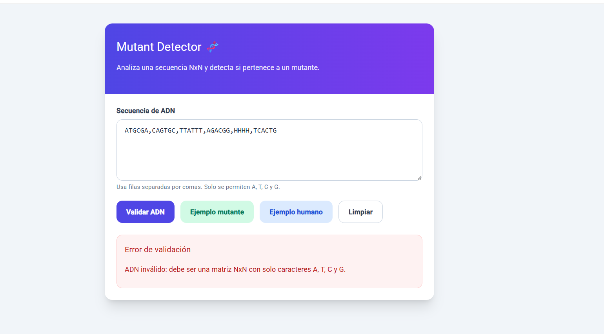

# 🧬 Mutant Detector

Aplicación web desarrollada en Angular que detecta si una secuencia de ADN pertenece a un mutante mediante el análisis de patrones en una matriz NxN.

## 🚀 Demo


*Interfaz principal con validación en tiempo real*

**Ejemplo de entrada:**
```
ATGCGA,CAGTGC,TTATGT,AGAAGG,CCCCTA,TCACTG
```

**Resultado:**
- ✅ **Mutante** → múltiples secuencias detectadas
- ❌ **Humano** → no cumple condiciones  
- ⚠️ **Error** → formato inválido


*Ejemplo de validación con caracteres inválidos*

## 📋 Descripción

Un humano es considerado mutante si su ADN contiene **más de una secuencia de 4 letras iguales** en cualquiera de estas direcciones:

- **Horizontal** →
- **Vertical** ↓
- **Diagonal principal** ↘
- **Diagonal inversa** ↙

## 🛠️ Tecnologías

- **Angular**
- **TypeScript**  
- **Reactive Forms**
- **Tailwind CSS**

## ⚙️ Instalación

```bash
git clone https://github.com/TU-USUARIO/mutant-detector.git
cd mutant-detector
npm install
npm start
```

**Abrir en:** 👉 http://localhost:4200

## 🧠 Uso

1. **Ingresa el ADN** separado por comas
2. **Ejemplo:**
   ```
   ATGCGA,CAGTGC,TTATGT,AGAAGG,CCCCTA,TCACTG
   ```
3. **Presiona** "Validar ADN"

También puedes usar los **botones de ejemplo**.

## 🧪 Algoritmo

Se recorre la matriz NxN buscando secuencias consecutivas de 4 caracteres iguales en 4 direcciones:

- ➡ **Horizontal**
- ⬇ **Vertical** 
- ↘ **Diagonal**
- ↙ **Diagonal inversa**

Si se encuentran **más de una**, el ADN es mutante.

**Complejidad:**
- **Tiempo:** O(n²)
- **Espacio:** O(n²)

## 📁 Estructura

```
src/app/
├── core/services/mutant.service.ts
├── features/mutant/components/mutant-checker/
├── app.module.ts
```

## 🎯 Decisiones técnicas

- **Separación de lógica** en servicio (MutantService)
- **Uso de Reactive Forms** para validación
- **Validación de matriz NxN** y caracteres permitidos
- **Corte temprano del algoritmo** al detectar múltiples secuencias  
- **UI ligera con Tailwind** para rapidez de desarrollo

---

**👨‍💻 Desarrollado como prueba técnica en Angular**